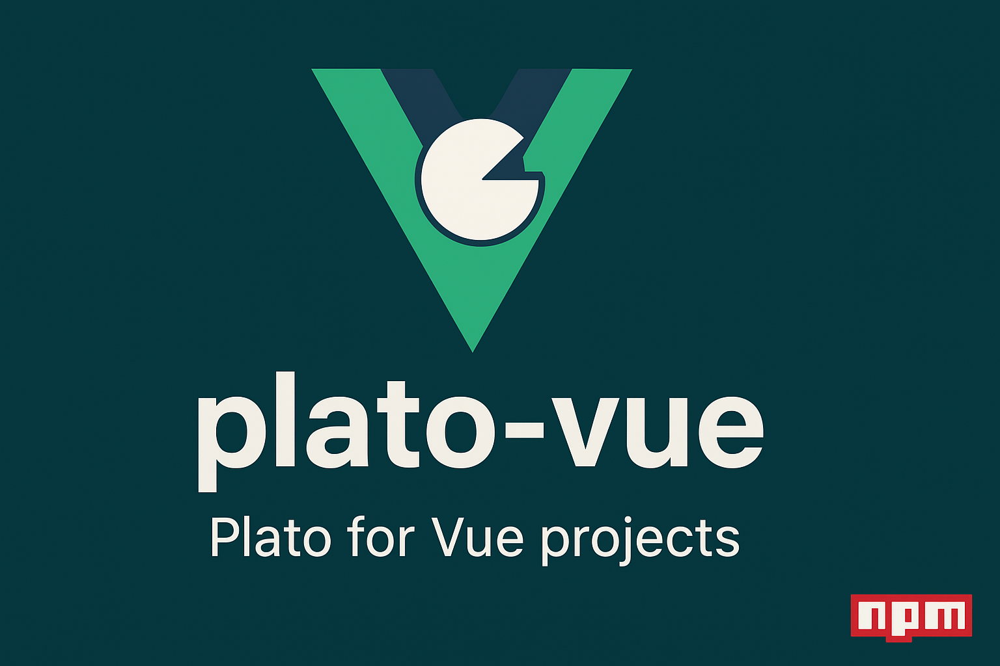

<div align="center">

# 🚀 Plato Vue.js & JavaScript Maintainability Analyzer

**Plato for Vue and JavaScript projects** - Clean, modular code analysis

[](https://www.npmjs.com/package/plato-vue)
[](https://www.npmjs.com/package/plato-vue)
[](https://opensource.org/licenses/MIT)



</div>

A globally installable Node.js package that analyzes Vue.js `.vue` files and JavaScript `.js` files to generate comprehensive maintainability reports using Plato.

## 🚀 Features

- **Vue.js Support**: Analyzes Vue Single File Components (SFC) by extracting `<script>` blocks
- **JavaScript Support**: Directly analyzes JavaScript files for comprehensive coverage
- **Maintainability Index**: Calculates and categorizes code maintainability scores
- **Cyclomatic Complexity**: Measures code complexity for better understanding
- **HTML Reports**: Generates detailed HTML reports with Plato's visualization
- **Global CLI**: Install once, use anywhere in your system
- **Modular Architecture**: Clean, maintainable code following Single Responsibility Principle

## 📦 Installation

```bash
npm install -g plato-vue
```

## 🎯 Usage

### Basic Usage
```bash
# Analyze current directory (Vue + JS files)
plato-vue

# Analyze specific directory
plato-vue src

# Analyze with custom output directory
plato-vue src custom-report
```

### Examples
```bash
# Analyze a Vue.js project
plato-vue "my-vue-project"

# Generate report in specific folder
plato-vue src "reports/maintainability"

# Quick test on current project
plato-vue . test-output
```

## 📈 Maintainability Categories

- **🟢 Excellent (85+)**: High-quality, easily maintainable code
- **🟡 Good (65-84)**: Good quality with room for minor improvements
- **🟠 Moderate (50-64)**: Moderate quality, consider refactoring
- **🔴 Low (<50)**: Poor quality, significant refactoring needed

## 📊 Output

### Console Output
```
🔍 Plato Vue.js & JavaScript Maintainability Analyzer
📁 Analyzing: C:\Users\Win Aung\projects\my-vue-project
📊 Output: C:\Users\Win Aung\projects\my-vue-project\plato-report

🔍 Found 15 Vue file(s):
   src\App.vue
   src\components\Header.vue
   ...

🔍 Found 8 JavaScript file(s):
   src\utils\helper.js
   src\services\api.js
   ...

📊 Summary: 23 files processed out of 23 total files (Vue + JS)

📊 Plato Analysis Results:

📁 src\App.vue (Vue):
   Maintainability Index: 85.50
   Cyclomatic Complexity: 2.10
   Lines of Code: 45
   Status: 🟢 Excellent

📁 src\utils\helper.js (JS):
   Maintainability Index: 78.20
   Cyclomatic Complexity: 3.45
   Lines of Code: 67
   Status: 🟡 Good

📈 Summary:
   Average Maintainability Index: 78.25
   Average Cyclomatic Complexity: 1.85
   Total Files Analyzed: 23

🌐 HTML Report generated at: C:\Users\Win Aung\projects\my-vue-project\plato-report\index.html
   Open this file in your browser for detailed analysis!

🧹 Temporary files cleaned up.
✅ Analysis complete!
```

### HTML Report
Generates a comprehensive HTML report with:
- File-by-file analysis (Vue + JavaScript)
- Maintainability Index charts
- Complexity metrics
- Code quality insights
- Interactive navigation

## 🐛 Troubleshooting

### Common Issues

**"No .vue or .js files found"**
- Ensure the target directory contains `.vue` or `.js` files
- Check file permissions
- Verify the path is correct

**"No script blocks found in Vue files"**
- Vue files must contain `<script>` tags
- Check for proper Vue SFC syntax

**Analysis errors**
- Some modern JavaScript syntax may not be supported by Plato
- Check console for specific error messages
- Verify Node.js version compatibility

## 🤝 Contributing

1. Fork the repository
2. Create a feature branch
3. Follow the existing code structure
4. Add tests for new functionality
5. Submit a pull request

## 📄 License

MIT License - see [LICENSE](LICENSE) file for details.

## 🙏 Acknowledgments

- Built with [Plato](https://github.com/es-analysis/plato) for code analysis
- Uses [glob](https://github.com/isaacs/node-glob) for file discovery
- Inspired by the need for Vue.js and JavaScript maintainability analysis

## 📞 Support

- **Issues**: [GitHub Issues](https://github.com/leon-99/plato-vue)
- **Discussions**: [GitHub Discussions](https://github.com/leon-99/plato-vue/discussions)
